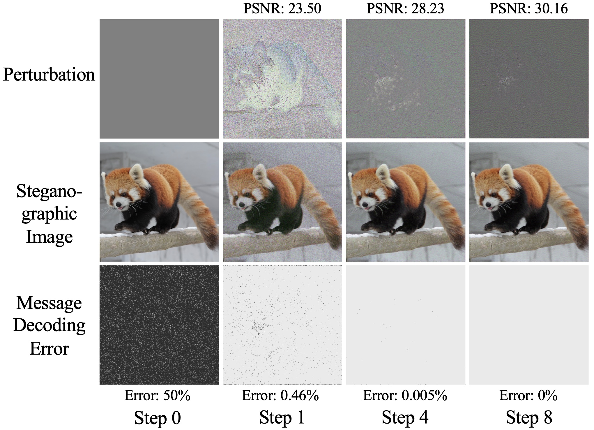

# Learning Iterative Neural Optimizers for Image Steganography (LISO)

This repo contains official PyTorch implementation of [Learning Iterative Neural Optimizers for Image Steganography](https://openreview.net/pdf?id=gLPkzWjdhBN) (ICLR 2023).

```
@inproceedings{chenlearning,
  title={Learning Iterative Neural Optimizers for Image Steganography},
  author={Chen, Xiangyu and Kishore, Varsha and Weinberger, Kilian Q},
  booktitle={The Eleventh International Conference on Learning Representations}
}
```

## Introduction
LISO is a learned steganographic optimizer that operates on the manifold of natural images. 
Compared to SOTA approaches, LISO is faster and more reliable, reducing recovery error rate by multiple orders of magnitude, and achieving zero error up to 3 bits per pixel. 
LISO is also highly extensible, e.g., to JPEG compression, or avoiding steganalysis detection.


*LISO iteratively optimizing a sample image with 3 bits encoded in each pixel, achieving **zero** error in 8 steps.*

## Prerequisites
- Python >= 3.6
- pyTorch >= 1.10.2
- CUDA >= 10.2
- cuDNN >= 7.6

## Getting Started
Download and extract [subsampled image datasets](https://drive.google.com/file/d/1ai9D3Z0lcdEnRX24pUL_XfuFSjWtbh5K) and [pretrained weights](https://drive.google.com/file/d/1128829Sq5nJJmckqYcdTUs4EmBeg3NGH) into `LISO/`. 
We provide our custom subset of [Div2k](https://data.vision.ee.ethz.ch/cvl/DIV2K/), [CelebA](https://mmlab.ie.cuhk.edu.hk/projects/CelebA.html), and [MS COCO](https://cocodataset.org), and corresponding trained LISO model weights under payload of `1-4 bits per pixel` / `JPEG compression` (on Div2k). 
Trained [SiaStegNet](https://ieeexplore.ieee.org/document/9153041) and [XuNet](https://dl.acm.org/doi/10.1145/3082031.3083236) weights are also included.

To use a custom dataset, organize images in the format below:

<pre>
LISO/
    | datasets/
        | DATASET_NAME/
            | train/
                | _
                    | img0000.xxx
                    | img0001.xxx
            | val/
                | _
                    | img0000.xxx
                    | img0001.xxx
</pre>

### Evaluation
LISO
```bash
python train_bits.py --eval --bits 1 --dataset div2k --load checkpoints/div2k/1_bits.steg
```

LISO + L-BFGS
```bash
python train_bits.py --eval --lbfgs --bits 1 --dataset div2k --load checkpoints/div2k/1_bits.steg
```

LISO + JPEG
```bash
python train_bits.py --eval --eval-jpeg --bits 1 --dataset div2k --load checkpoints/div2k_jpeg/1_bits.steg
```

LISO + Avoiding XuNet Detection
```bash
python train_bits.py --eval --test-xunet-weight 100 --bits 1 --dataset div2k --load checkpoints/div2k/1_bits.steg
```

### Training
LISO
```bash
python train_bits.py --bits 1 --dataset div2k
```

LISO + JPEG
```bash
python train_bits.py --bits 1 --dataset div2k --jpeg
```

## Acknowledgements
- [SteganoGAN](https://github.com/DAI-Lab/SteganoGAN)
- [RAFT](https://github.com/princeton-vl/RAFT)
- [SiaStegNet](https://github.com/SiaStg/SiaStegNet)
- [XuNet](https://github.com/brijeshiitg/XuNet-Structural-Design-of-Convolutional-Neural-Networksfor-Steganalysis)